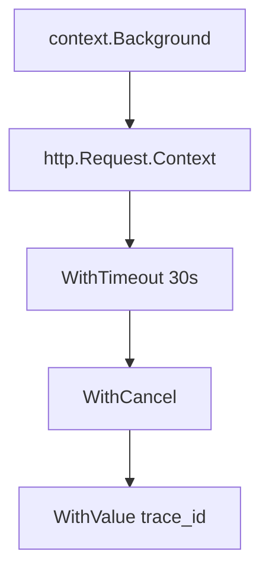

# Deep Dive into Go Context

Every HTTP handler, database query, and background job in a Go service eventually needs the same three things: a way to **stop work** when the caller leaves, a **deadline** so slow dependencies do not hang forever, and sometimes **request-scoped metadata** (trace IDs, user IDs) that should not live in global variables.

The standard library answers this with **`context`**. It is not glamorous, but it is the glue between your API boundary and everything that runs underneath. Misuse it and you get goroutine leaks, ignored timeouts, and mysterious cancellations. Use it well and cancellation, deadlines, and values propagate through your call tree in a predictable way.

In this post we walk through how `context` works under the hood, the API surface, real patterns in servers and clients, and the mistakes that show up most often in production code.

---

# Context Interface
```go

type Context interface {
  Deadline() (deadline time.Time, ok bool)
  Done() <-chan struct{}
  Err() error
  Value(key interface{}) interface{}
}

# Empty Context

A context with no value, no deadline and is never cancelled. 

type emptyCtx int

func (*emptyCtx) Deadline() (dealine time.Time, ok bool) {
    return
}

func (*emptyCtx) Done() <-chan struct{} {
    return nil
}

func (*emptyCtx) Err() error {
    return nil
}

func (*emptyCtx) Value(key interface{}) interface{} {
    return nil
}

func (*emptyCtx) String() string {
    switch e {
        case background:
            return "context.Background"
        case todo: 
            return "context.ToDo"
    }
        return "unknown empty Context"
}
```


## Why Context Exists

Before `context` landed in Go 1.7, teams invented ad hoc cancellation: boolean flags, `done` channels, or closing connections and hoping goroutines noticed. That does not compose. A handler might spawn five goroutines; when the client disconnects, which flag do you flip?

`context` gives you a single **immutable tree** of cancellation scopes:

- **Cancel** work when a parent operation ends (client disconnect, parent goroutine exits).
- **Bound time** with deadlines and timeouts.
- **Attach values** that are safe to pass down the call stack (not for optional parameters).

The package documentation is explicit: **contexts are for cancellation and request-scoped data, not for passing optional function arguments.**

---

## The `Context` Interface

Everything you receive or pass is this interface:

```go
type Context interface {
    Deadline() (deadline time.Time, ok bool)
    Done() <-chan struct{}
    Err() error
    Value(key any) any
}
```

| Method | Role |
|--------|------|
| `Done()` | Closed when this context is canceled or times out. Block on `<-ctx.Done()` or use `select` with other channels. |
| `Err()` | `nil` while active; after cancel, `context.Canceled`; after deadline, `context.DeadlineExceeded`. |
| `Deadline()` | Reports whether a deadline was set and when it fires. |
| `Value()` | Looks up a key in the context chain (see values later). |

Implementations are **read-only** after creation. You never mutate a context; you **derive** a child with `WithCancel`, `WithTimeout`, `WithDeadline`, or `WithValue`.

---

## The Context Tree

At the root of every program you use one of two sentinels:

```go
ctx := context.Background() // non-nil default for main, init, tests
ctx := context.TODO()       // placeholder when you are unsure which ctx to use
```

Real request handling almost always starts from an incoming context and builds downward:



**Cancellation propagates up the tree:** canceling a parent cancels all descendants. Canceling a child does **not** cancel the parent or siblings.

### `WithCancel`

```go
ctx, cancel := context.WithCancel(parent)
defer cancel() // always call cancel to release resources

go func() {
    select {
    case <-ctx.Done():
        return // parent canceled
    case result := <-work:
        // ...
    }
}()
```

`cancel()` is idempotent. Call it when the operation finishes **or** when you no longer need the child scope—even if the work succeeded. The child’s goroutines and timers depend on `cancel` for cleanup.

### `WithTimeout` and `WithDeadline`

```go
ctx, cancel := context.WithTimeout(parent, 5*time.Second)
defer cancel()

ctx, cancel := context.WithDeadline(parent, time.Now().Add(5*time.Second))
defer cancel()
```

Both schedule automatic cancellation. Prefer **`WithTimeout`** for relative durations; use **`WithDeadline`** when you already have an absolute time (e.g. from an upstream `Retry-After` header).

After expiry, `ctx.Err()` is `context.DeadlineExceeded`.

### `WithValue`

```go
type ctxKey string

const traceIDKey ctxKey = "trace_id"

ctx = context.WithValue(parent, traceIDKey, "abc-123")
id := ctx.Value(traceIDKey).(string)
```

Rules from the Go team:

- Use **unexported custom types** for keys (not strings), to avoid collisions across packages.
- Values must be **immutable** and safe for concurrent reads.
- Do not pass **business logic inputs** (DB handles, loggers, config)—pass those as explicit parameters.

---

## Cancellation in Practice

### Checking `Done` and `Err`

Long-running loops and I/O should respect the context:

```go
func fetchAll(ctx context.Context, urls []string) error {
    for _, u := range urls {
        if err := ctx.Err(); err != nil {
            return err
        }
        if err := fetchOne(ctx, u); err != nil {
            return err
        }
    }
    return nil
}
```

For blocking operations that accept `context.Context` (`http.NewRequestWithContext`, `db.QueryContext`), pass `ctx` through. For APIs that do not, use `select`:

```go
select {
case <-ctx.Done():
    return ctx.Err()
case result := <-ch:
    return process(result)
}
```

### `context.Cause` (Go 1.20+)

When you cancel with a reason, callers can inspect it:

```go
ctx, cancel := context.WithCancelCause(parent)
cancel(errors.New("user clicked stop"))

if err := context.Cause(ctx); err != nil {
    log.Println(err)
}
```

Useful for distinguishing “client disconnected” from “admin shutdown” while still returning `context.Canceled` from `ctx.Err()`.

---

## HTTP Servers and Clients

### Server: one context per request

`net/http` attaches a context to each request. It is canceled when:

- The client closes the connection.
- The handler returns (for most cases).
- `ResponseController` or similar ends the request.

```go
func handler(w http.ResponseWriter, r *http.Request) {
    ctx := r.Context()

    ctx, cancel := context.WithTimeout(ctx, 2*time.Second)
    defer cancel()

    user, err := db.GetUser(ctx, r.URL.Query().Get("id"))
    if err != nil {
        if errors.Is(err, context.DeadlineExceeded) {
            http.Error(w, "timeout", http.StatusGatewayTimeout)
            return
        }
        http.Error(w, err.Error(), http.StatusInternalServerError)
        return
    }
    json.NewEncoder(w).Encode(user)
}
```

Always derive timeouts from **`r.Context()`**, not `context.Background()`, so client disconnects still cancel downstream work.

### Client: bound outbound calls

```go
req, err := http.NewRequestWithContext(ctx, http.MethodGet, url, nil)
if err != nil {
    return err
}
resp, err := http.DefaultClient.Do(req)
```

If the parent request is canceled, the outbound request should be too—otherwise you waste resources on a response nobody will read.

---

## `errgroup`: Coordinated Goroutines

`golang.org/x/sync/errgroup` combines a context with a group of goroutines: **first error wins**, and canceling the group context stops the rest.

```go
g, ctx := errgroup.WithContext(parent)

g.Go(func() error {
    return fetchA(ctx)
})
g.Go(func() error {
    return fetchB(ctx)
})

if err := g.Wait(); err != nil {
    return err // ctx is canceled; other goroutines should exit
}
```

This is the idiomatic pattern for “fan out, fail fast, do not leak goroutines.”

---

## Common Mistakes

### Storing `context.Context` in a struct

Contexts are **request-scoped**. Putting them on a `Service` or `Repository` struct ties lifetime to the wrong scope and makes cancellation ambiguous. Pass `ctx` as the **first parameter** of methods that need it:

```go
func (r *Repo) FindUser(ctx context.Context, id string) (*User, error)
```

### Using `context.Background()` inside handlers

That severs the link to the client. Downstream work keeps running after disconnect. Use the context you were given.

### Ignoring `cancel()`

Skipping `defer cancel()` after `WithTimeout`/`WithCancel` leaks the timer and internal goroutine until the parent is canceled. Always call `cancel()` in a `defer`.

### `WithValue` as a parameter bag

Passing loggers, DB pools, or feature flags through `WithValue` hides dependencies and breaks tests. Reserve values for **cross-cutting request metadata** (trace ID, auth claims already validated at the edge).

### Passing `nil` context

Many APIs treat `nil` as “no deadline” but it is **not** valid per the interface contract. Use `context.Background()` or `context.TODO()` if you truly have no parent.

---

## Design Guidelines (Checklist)

1. **First parameter:** `func DoSomething(ctx context.Context, ...)`.
2. **Do not store** contexts in structs.
3. **Derive** child contexts for sub-operations; **defer cancel()** on every derived context.
4. **Propagate** the same `ctx` to every layer that supports it.
5. **Prefer timeouts** at API boundaries (HTTP handler, RPC entry), not deep in every helper.
6. **Check `ctx.Err()`** in loops; use context-aware I/O APIs when available.
7. **Keep values small and typed**; avoid string keys.

---

## Mental Model

Think of `context` as a **deadline and cancel signal** that flows with your call stack, not as a generic map or dependency injection container.

```text
Client disconnect / timeout / explicit cancel
        │
        ▼
   ctx.Done() closed
        │
        ├── goroutines exit via select
        ├── QueryContext aborts SQL
        └── http.Client cancels outbound request
```

When you design a new function that might block or spawn work, ask: **“What happens if the caller gives up?”** If the answer matters, take `context.Context` and honor `Done()`.

---

## Conclusion

`context` is one of the smallest packages in Go and one of the most impactful for production services. It standardizes **cancellation**, **deadlines**, and **request-scoped values** so microservices, HTTP handlers, and worker pools behave consistently under load and failure.

Master the tree model (`Background` → derived scopes), always **`defer cancel()`**, wire **`r.Context()`** through your stack, and reserve **`WithValue`** for true request metadata. Get those right and you avoid a large class of goroutine leaks and hung requests—without inventing your own cancellation protocol in every project.

---

✍️ *Written by Chirag Gupta — documenting my journey in Go Concurrency & Cloud Native.*
